<div align="center">

```text
         />_________________________________
[########[]_________________________________>
         \>
```

# ⛩️ servicenow-mcp ⛩️
### ⚔️ 武士道 (BUSHIDO) エディション ⚔️

<br/>

[](https://github.com/tedorigawa001/ServiceNow-MCP)
[](docs/TOOLS.md)
[](https://www.typescriptlang.org/)
[](LICENSE)
[](https://nodejs.org)
[](https://modelcontextprotocol.io)

<br/>

## AI から ServiceNow を自然言語で操作する MCP サーバー

> **ローカル PC で動作 · 400+ ツール · 5 分セットアップ · MIT ライセンス**

Claude・Cursor・VS Code などの AI ツールから、ServiceNow のインシデント・変更・CMDB・スクリプトなどをすべて自然言語で操作できます。

</div>

---

## このツールが何をするか（初心者向け）

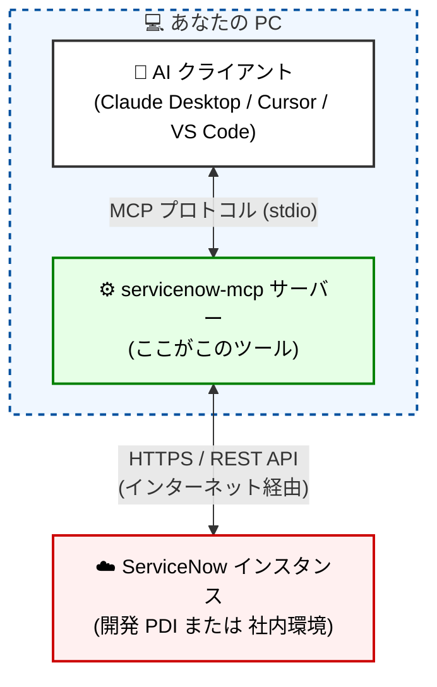

**ポイント:**
- サーバーは **あなたの PC 上で動く** Node.js プロセスです。ServiceNow 以外の第三者サービスには接触しません
- AI クライアントと stdio（標準入出力）で通信するため、ポート開放やネットワーク設定は不要
- ServiceNow へは HTTPS で接続します。既存のブラウザアクセスと同じ経路です

---

## 推奨環境

> **まずは開発インスタンス (PDI) でお試しください。**  
> 本番環境への接続は技術的には可能ですが、AI の誤操作・意図しないレコード更新を防ぐため、  
> **はじめは読み取り専用モード (`WRITE_ENABLED=false`) で動作を確認してから本番適用してください。**

| 環境 | 推奨度 | 注意 |
|------|--------|------|
| **PDI (無料開発インスタンス)** | ★★★ 推奨 | 無料。操作の影響なし。初めて使う方はここから |
| **社内開発・検証インスタンス** | ★★☆ 可 | チームと共有している場合は読み取り専用で開始 |
| **本番インスタンス** | ★☆☆ 要注意 | `WRITE_ENABLED=false` + 専用サービスアカウント必須 |

無料 PDI → [developer.servicenow.com](https://developer.servicenow.com)

---

## 動作の仕組み

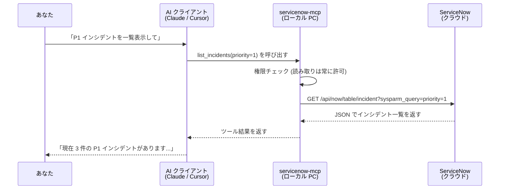

---

## はじめての方向け — 5 分セットアップ

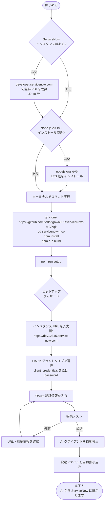

### ステップ 1 — ソースからビルド

```bash
# Node.js のバージョン確認 (20.19 以上が必要)
node --version

# リポジトリをクローン
git clone https://github.com/tedorigawa001/ServiceNow-MCP.git
cd servicenow-mcp

# 依存パッケージのインストール
npm install

# TypeScript をコンパイル
npm run build

# セットアップウィザードを起動
npm run setup
```

ウィザードが Claude Desktop・Cursor・VS Code などを自動検出し、設定ファイルを書き込みます。  
AI クライアントの設定には `dist/server.js` の絶対パスが必要です（例: `/Users/yourname/servicenow-mcp/dist/server.js`）。

### ステップ 2 — AI クライアントを再起動

設定ファイルを書き込んだあと、Claude Desktop や Cursor を **一度完全に終了して再起動** してください。

### ステップ 3 — 動作確認

AI に話しかけてみましょう:
```
「ServiceNow に接続して、直近のインシデントを 5 件表示してください」
```

---

## Docker での起動

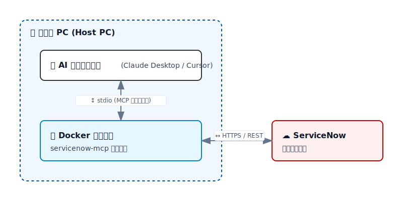

### ソースビルド vs Docker — どちらを選ぶか

| 比較項目 | ソースビルド（`node dist/server.js`） | Docker（`docker run`） |
|---------|--------------------------------------|----------------------|
| **起動速度** | ✅ 即時 | ⚠️ コンテナ起動分のオーバーヘッドあり |
| **設定のシンプルさ** | ⚠️ 絶対パスが必要 | ✅ `docker` コマンドのみ |
| **環境依存** | Node.js 20.19+ が必要 | Docker が必要 |
| **環境の統一** | ⚠️ ホスト環境に依存 | ✅ どの PC でも同一環境 |
| **チーム配布・CI/CD** | ⚠️ 各自でビルドが必要 | ✅ イメージを共有するだけ |
| **推奨シーン** | 個人利用・開発 | チーム配布・本番運用 |

### イメージのビルドと起動

```bash
# イメージをビルド
docker build -t servicenow-mcp .

# 起動
docker run --rm -i \
  -e SERVICENOW_INSTANCE_URL=https://yourinstance.service-now.com \
  -e SERVICENOW_OAUTH_CLIENT_ID=your_client_id \
  -e SERVICENOW_OAUTH_CLIENT_SECRET=your_client_secret \
  servicenow-mcp
```

Password Grant を使う場合は、さらに以下を追加します:

```bash
  -e SERVICENOW_OAUTH_USERNAME=service_account_user \
  -e SERVICENOW_OAUTH_PASSWORD=service_account_password \
```

### AI クライアントから接続する（Claude Desktop）

`claude_desktop_config.json` の `command` / `args` を以下のように変更します。
Client Credentials を使う場合は `SERVICENOW_OAUTH_USERNAME` と `SERVICENOW_OAUTH_PASSWORD` の 2 行を省略してください。

```json
{
  "mcpServers": {
    "servicenow": {
      "command": "docker",
      "args": [
        "run", "--rm", "-i",
        "-e", "SERVICENOW_INSTANCE_URL=https://yourinstance.service-now.com",
        "-e", "SERVICENOW_OAUTH_CLIENT_ID=your_client_id",
        "-e", "SERVICENOW_OAUTH_CLIENT_SECRET=your_client_secret",
        "-e", "SERVICENOW_OAUTH_USERNAME=service_account_user",
        "-e", "SERVICENOW_OAUTH_PASSWORD=service_account_password",
        "servicenow-mcp"
      ]
    }
  }
}
```

> **注意**: `-i` フラグは必須です。MCP は stdio（標準入出力）で通信するため、インタラクティブモードが必要です。

> **HTTP モードで起動する場合**: コンテナ内の既定バインドは `127.0.0.1` のため公開ポートからは到達できません。
> `-e MCP_TRANSPORT=http -e MCP_HTTP_HOST=0.0.0.0 -p 3000:3000` を付与してください。
> イメージは非 root(`node` ユーザー)で動作し、`EXPOSE 3000` 済みです。

---

## 認証方式（OAuth 2.0 のみ）

このサーバーは **OAuth 2.0 のみ** をサポートします。Basic Auth はセキュリティリスク（資格情報が平文で設定ファイルに残る）があるため廃止しました。

OAuth 2.0 には 2 種類のグラントタイプがあり、用途に応じて自動選択されます。

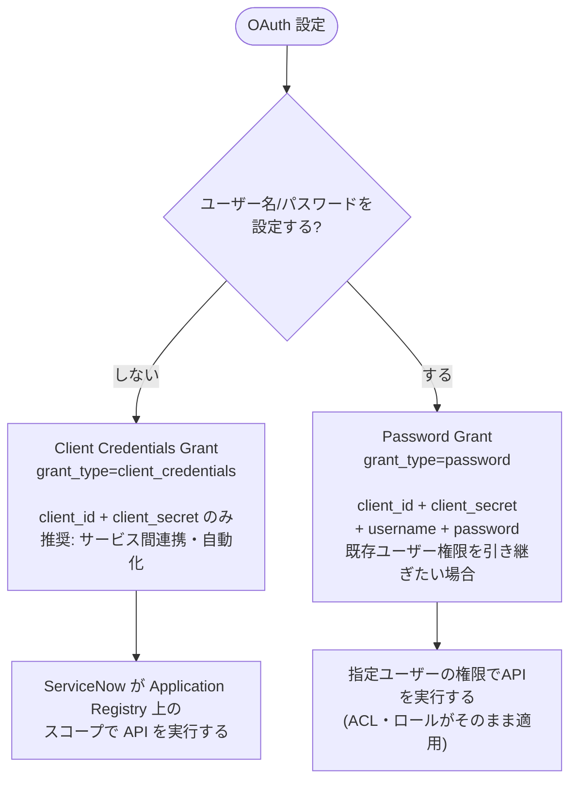

### Client Credentials（推奨）

`client_id` と `client_secret` だけで動作します。ユーザー資格情報が不要なため、サービス間連携に最適です。

```bash
SERVICENOW_INSTANCE_URL=https://dev12345.service-now.com
SERVICENOW_OAUTH_CLIENT_ID=your_client_id
SERVICENOW_OAUTH_CLIENT_SECRET=your_client_secret
```

### Password Grant（ユーザー権限を引き継ぐ場合）

特定ユーザーの ACL・ロールで API を実行したい場合に使います。

```bash
SERVICENOW_INSTANCE_URL=https://dev12345.service-now.com
SERVICENOW_OAUTH_CLIENT_ID=your_client_id
SERVICENOW_OAUTH_CLIENT_SECRET=your_client_secret
SERVICENOW_OAUTH_USERNAME=svc_mcp
SERVICENOW_OAUTH_PASSWORD=your_password
```

---

## OAuth セットアップ手順

> OAuth は ServiceNow の管理者権限が必要です。PDI では自分で設定できます。

### ServiceNow 側の設定

**Step 1 — OAuth アプリケーションレジストリを作成**

1. ServiceNow にログイン
2. 左メニューで「Application Registry」を検索
3. 「New」→ **「New Inbound Integration Experience」** を選択

> ⚠️ 「[Deprecated UI] Create an OAuth API endpoint for external clients」は**旧 UI** です。  
> 現行バージョンでは **New Inbound Integration Experience** を使用してください。

グラントタイプによって設定が異なります。

#### Client Credentials Grant（推奨）

> **重要**: Client Credentials Grant では ServiceNow 側でユーザーを指定する必要があります。  
> これは標準 OAuth の仕様とは異なる ServiceNow 固有の要件です。  
> アクセストークンは「どのユーザーとして API を実行するか」を ServiceNow が決定するために使用します。

```
Name:              servicenow-mcp
Token Format:      JWT                ← 必須
Client ID:         (自動生成)
Client Secret:     (自動生成 → コピーして保存)
Redirect URL:      http://localhost
Access Token Lifespan: 1800 (秒)
Default Grant user: svc_mcp          ← 必須: API を実行するサービスアカウントを指定
```

`Default Grant user` に指定したユーザーの **ロール・ACL** が API 実行時に適用されます。  
このユーザーには必要最小限の ServiceNow ロール（例: `itil`, `admin` 等）を付与してください。

#### Password Grant

```
Name:              servicenow-mcp
Token Format:      JWT                ← 必須
Client ID:         (自動生成)
Client Secret:     (自動生成 → コピーして保存)
Redirect URL:      http://localhost
Access Token Lifespan: 1800 (秒)
Default Grant user: (不要 — username/password で指定したユーザーが使われます)
```

「Submit」で保存。

**Step 2 — 生成された Client ID / Secret を確認**

作成したレジストリを開き、`Client ID` と `Client Secret` をメモします。

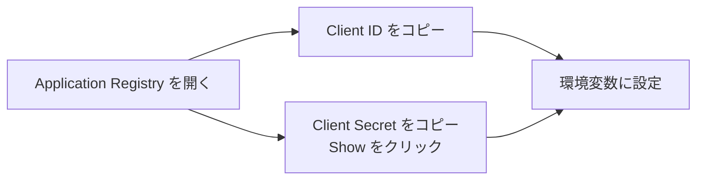

### MCP サーバー側の設定

#### Client Credentials Grant

```bash
SERVICENOW_INSTANCE_URL=https://dev12345.service-now.com
SERVICENOW_OAUTH_CLIENT_ID=your_client_id
SERVICENOW_OAUTH_CLIENT_SECRET=your_client_secret
# SERVICENOW_OAUTH_USERNAME / PASSWORD は不要
```

#### Password Grant

```bash
SERVICENOW_INSTANCE_URL=https://dev12345.service-now.com
SERVICENOW_OAUTH_CLIENT_ID=your_client_id
SERVICENOW_OAUTH_CLIENT_SECRET=your_client_secret
SERVICENOW_OAUTH_USERNAME=svc_mcp
SERVICENOW_OAUTH_PASSWORD=your_password
```

接続確認:
```bash
node dist/cli/index.js auth test
```

---

## AI クライアント別セットアップ

### Claude Desktop

設定ファイル: `~/Library/Application Support/Claude/claude_desktop_config.json`

```json
{
  "mcpServers": {
    "servicenow": {
      "command": "node",
      "args": ["/path/to/servicenow-mcp/dist/server.js"],
      "env": {
        "SERVICENOW_INSTANCE_URL": "https://dev12345.service-now.com",
        "SERVICENOW_OAUTH_CLIENT_ID": "your_client_id",
        "SERVICENOW_OAUTH_CLIENT_SECRET": "your_client_secret",
        "WRITE_ENABLED": "false"
      }
    }
  }
}
```

> `WRITE_ENABLED: "false"` にしておくと読み取り専用になります。動作確認が終わったら `"true"` に変更できます。  
> ユーザー権限を引き継ぐ場合は `SERVICENOW_OAUTH_USERNAME` と `SERVICENOW_OAUTH_PASSWORD` も追加してください。

### Claude Code CLI

```bash
claude mcp add servicenow node /path/to/servicenow-mcp/dist/server.js \
  --env SERVICENOW_INSTANCE_URL=https://dev12345.service-now.com \
  --env SERVICENOW_OAUTH_CLIENT_ID=your_client_id \
  --env SERVICENOW_OAUTH_CLIENT_SECRET=your_client_secret \
  --env WRITE_ENABLED=false
```

### Cursor

設定ファイル: `.cursor/mcp.json`

```json
{
  "mcpServers": {
    "servicenow": {
      "command": "node",
      "args": ["/path/to/servicenow-mcp/dist/server.js"],
      "env": {
        "SERVICENOW_INSTANCE_URL": "https://dev12345.service-now.com",
        "SERVICENOW_OAUTH_CLIENT_ID": "your_client_id",
        "SERVICENOW_OAUTH_CLIENT_SECRET": "your_client_secret",
        "WRITE_ENABLED": "true",
        "SCRIPTING_ENABLED": "true"
      }
    }
  }
}
```

### VS Code (1.99+)

設定ファイル: `.vscode/mcp.json`

```json
{
  "servers": {
    "servicenow": {
      "type": "stdio",
      "command": "node",
      "args": ["/path/to/servicenow-mcp/dist/server.js"],
      "env": {
        "SERVICENOW_INSTANCE_URL": "https://dev12345.service-now.com",
        "SERVICENOW_OAUTH_CLIENT_ID": "your_client_id",
        "SERVICENOW_OAUTH_CLIENT_SECRET": "your_client_secret"
      }
    }
  }
}
```

### 対応クライアント一覧

| クライアント | 種別 | ガイド |
|------------|------|--------|
| Claude Desktop | デスクトップ | [Setup](clients/claude-desktop/SETUP.md) |
| Claude Code CLI | ターミナル | [Setup](clients/claude-code/SETUP.md) |
| Cursor | AI エディタ | [Setup](clients/cursor/SETUP.md) |
| Windsurf | AI エディタ | [Setup](docs/CLIENT_SETUP.md) |
| VS Code (Native MCP 1.99+) | IDE | [Setup](clients/vscode/SETUP.md) |
| VS Code + GitHub Copilot | IDE | [Setup](clients/vscode/SETUP.md) |
| VS Code + Continue.dev | IDE | [Setup](docs/CLIENT_SETUP.md) |
| VS Code + Cline | IDE | [Setup](docs/CLIENT_SETUP.md) |
| JetBrains AI | IDE | [Setup](docs/CLIENT_SETUP.md) |
| Amazon Q Developer | IDE / CLI | [Setup](docs/CLIENT_SETUP.md) |
| ChatGPT / OpenAI API | API | [Setup](clients/codex/SETUP.md) |
| Google Gemini API | API | [Setup](clients/gemini/SETUP.md) |
| Ollama (ローカル LLM) | ローカル | [Setup](docs/CLIENT_SETUP.md) |

全クライアントのセットアップ詳細 → [docs/CLIENT_SETUP.md](docs/CLIENT_SETUP.md)

---

## トランスポート（stdio / HTTP）

デフォルトは **stdio**（標準入出力）で、ポート開放やネットワーク設定は不要です。
ブラウザ経由の接続（Claude.ai Web UI）、Docker コンテナ公開、複数クライアントでのサーバー共有、
CI/CD からの呼び出しが必要な場合は **Streamable HTTP** トランスポートに切り替えられます。

```bash
# HTTP トランスポートで起動
MCP_TRANSPORT=http node dist/server.js
# → http://127.0.0.1:3000/mcp で待ち受け、GET /health でヘルスチェック
```

| 環境変数 | デフォルト | 説明 |
|---|---|---|
| `MCP_TRANSPORT` | `stdio` | `http` で Streamable HTTP に切り替え |
| `MCP_HTTP_PORT` | `3000` | 待ち受けポート |
| `MCP_HTTP_HOST` | `127.0.0.1` | バインドアドレス（外部公開時は `0.0.0.0`）|
| `MCP_HTTP_PATH` | `/mcp` | MCP エンドポイントのパス |
| `MCP_HTTP_CORS_ORIGIN` | `*` | CORS 許可オリジン |
| `MCP_HTTP_ALLOWED_HOSTS` | (なし) | カンマ区切り。指定すると DNS リバインディング保護を有効化 |
| `MCP_HTTP_ALLOWED_ORIGINS` | (なし) | カンマ区切り。Origin ヘッダの許可リスト |

セッションは MCP 仕様に従い、`initialize` 応答の `Mcp-Session-Id` ヘッダで払い出され、
以降のリクエストで再利用します（`DELETE /mcp` でセッション終了）。HTTP 接続するクライアント設定例:

```json
{
  "mcpServers": {
    "servicenow": {
      "url": "http://localhost:3000/mcp"
    }
  }
}
```

> **セキュリティ注意**: デフォルトは loopback（`127.0.0.1`）バインドです。`MCP_HTTP_HOST=0.0.0.0`
> で外部公開する場合は、リバースプロキシでの TLS 終端・認証、および `MCP_HTTP_ALLOWED_HOSTS` /
> `MCP_HTTP_ALLOWED_ORIGINS` による保護を推奨します。

---

## 権限設定（何ができるかを制御する）

デフォルトは**読み取り専用**です。操作範囲を広げたい場合は環境変数で段階的に有効化します。

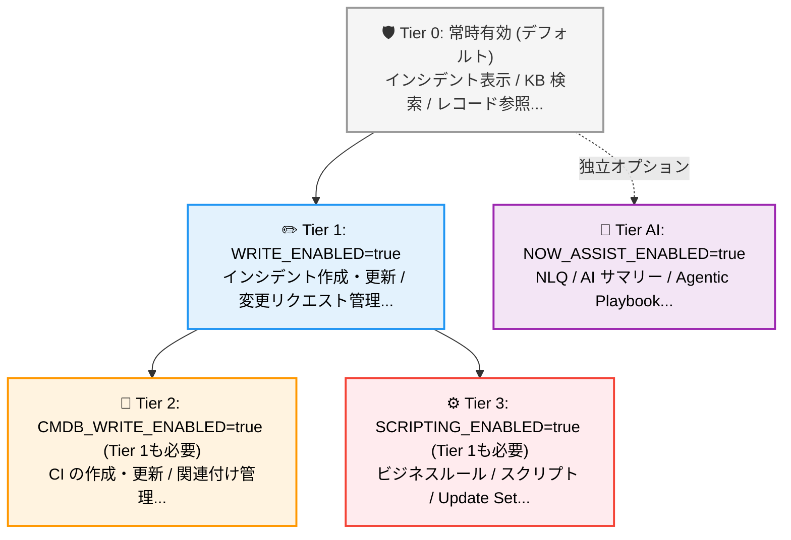

**本番環境で使う場合の推奨設定:**
```bash
WRITE_ENABLED=false          # まずは読み取りのみで確認
CMDB_WRITE_ENABLED=false
SCRIPTING_ENABLED=false      # 本番では原則 false のまま
```

---

## ロールベース ツールパッケージ

`MCP_TOOL_PACKAGE` 環境変数でツールを絞り込めます。全部入りではなく、用途に応じたセットを使うと AI が迷わずに済みます。

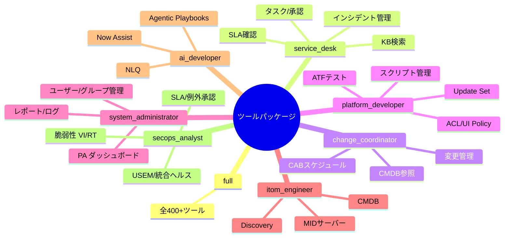

| パッケージ名 | 対象ロール | 主なツール |
|------------|----------|-----------|
| `full` | 管理者 | 全ツール (400+) |
| `service_desk` | L1/L2 エージェント | インシデント・タスク・KB・SLA |
| `change_coordinator` | 変更管理者 | 変更リクエスト・CAB・CMDB |
| `knowledge_author` | KB 著者 | KB 作成・公開 |
| `catalog_builder` | カタログ管理者 | カタログ・承認ルール |
| `system_administrator` | システム管理者 | ユーザー・グループ・レポート |
| `platform_developer` | 開発者 | スクリプト・ATF・Update Set |
| `portal_developer` | ポータル開発者 | ポータル・ウィジェット・UX |
| `integration_engineer` | 統合エンジニア | REST・Transform・イベント |
| `itom_engineer` | ITOM エンジニア | CMDB・Discovery・MID |
| `agile_manager` | スクラムマスター | ストーリー・エピック |
| `ai_developer` | AI 開発者 | Now Assist・NLQ・Playbook |
| `itam_analyst` | 資産管理者 | 資産・ライセンス・契約 |
| `secops_analyst` | SecOps アナリスト | 脆弱性(VI/RT)・USEM・統合ヘルス・SLA・例外承認 |
| `devops_engineer` | DevOps | パイプライン・デプロイ |

詳細 → [docs/TOOL_PACKAGES.md](docs/TOOL_PACKAGES.md)

---

## 使用例

### 自然言語で操作する

```
「Network Operations グループの P1 インシデントをすべて表示して」

「INC0012345 に "調査中。30 分以内に更新します" とワークノートを追加して」

「SAP 本番システムの障害でインシデントを作成して。
  優先度 Critical、Network Ops グループに割り当てて」

「先月の Priority 別インシデント件数をグラフ用データで出して」
```

### 典型的なやりとりの流れ

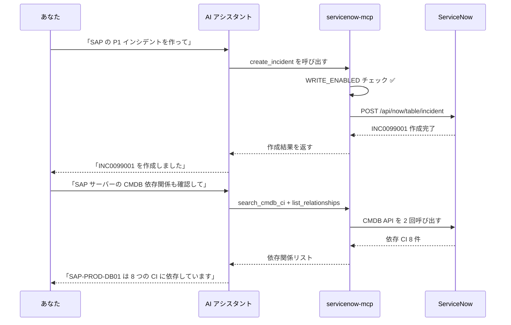

### スラッシュコマンド & @メンション

```
/morning-standup  → P1/P2 オープンインシデント・当日変更・SLA 違反のサマリー
/my-tickets       → 自分に割り当てられたオープンタスク一覧
/p1-alerts        → アクティブな P1 インシデント一覧

@my-incidents     → 自分のインシデントをコンテキストに追加
@ci:web-prod-01   → CMDB CI レコードをコンテキストに追加
@kb:VPN-setup     → KB 記事をコンテキストに追加
```

120+ の実例 → [EXAMPLES.md](EXAMPLES.md)

---

## マルチインスタンス対応

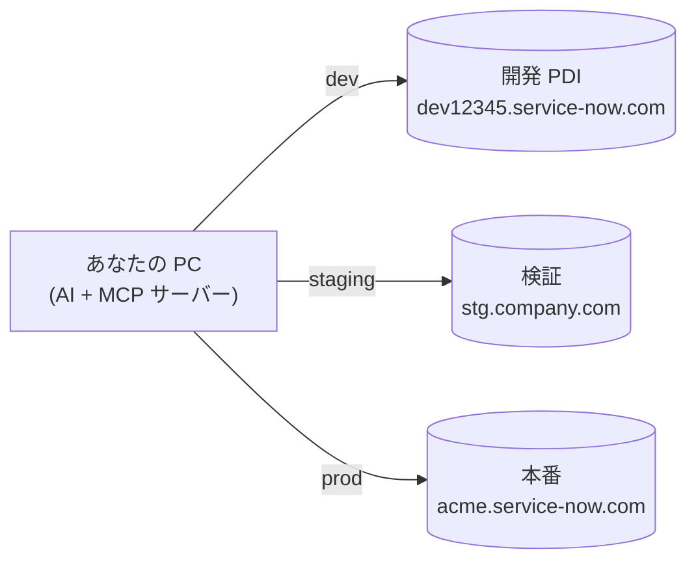

```json
{
  "default_instance": "dev",
  "instances": {
    "dev": {
      "url": "https://dev12345.service-now.com",
      "client_id": "dev-client-id",
      "client_secret": "dev-client-secret"
    },
    "prod": {
      "url": "https://acme.service-now.com",
      "auth": "oauth",
      "client_id": "xxx",
      "client_secret": "yyy",
      "username": "svc_account",
      "password": "zzz"
    }
  }
}
```

```bash
SN_INSTANCES_CONFIG=/path/to/instances.json
```

詳細 → [docs/MULTI_INSTANCE.md](docs/MULTI_INSTANCE.md)

---

## モジュールカバレッジ

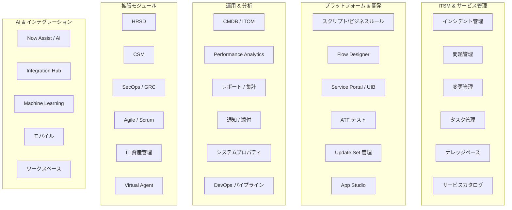

---

## プロジェクト構造

```
servicenow-mcp/
├── src/
│   ├── server.ts                   # MCP サーバーエントリーポイント
│   ├── servicenow/
│   │   ├── client.ts               # REST API クライアント (OAuth)
│   │   ├── instances.ts            # マルチインスタンスマネージャー
│   │   └── types.ts                # TypeScript 型定義
│   ├── tools/                      # 37 ドメインモジュール (400+ ツール)
│   │   ├── index.ts                # ツールルーター & パッケージ定義
│   │   ├── incident.ts
│   │   ├── change.ts
│   │   ├── knowledge.ts
│   │   └── ...
│   ├── prompts/                    # スラッシュコマンド定義
│   ├── resources/                  # @メンション定義
│   ├── cli/                        # セットアップウィザード
│   └── utils/
│       ├── permissions.ts          # 5 段階権限ゲート
│       └── errors.ts
├── tests/                          # ユニットテスト (Vitest · 510 件)
├── docs/                           # ドキュメント
└── instances.example.json
```

---

## 開発

```bash
npm install          # 依存パッケージのインストール
npm run build        # TypeScript → dist/ にコンパイル
npm test             # ユニットテストを実行 (510 件)
npm run dev          # ウォッチモード
npm run type-check   # 型チェックのみ
npm run lint         # ESLint
```

---

## よくある質問

**ServiceNow の API 知識は必要ですか？**  
いいえ。「P1 インシデントを一覧表示して」のように日本語で話しかけるだけです。API 呼び出しはサーバーが自動で行います。

**本番環境に接続しても大丈夫ですか？**  
`WRITE_ENABLED=false`（デフォルト）で接続する分には読み取りのみで安全です。書き込みを有効にする前に、必ず開発環境で動作を確認してください。

**無料で使えますか？**  
このサーバー自体は MIT ライセンスで無料です。ServiceNow の無料 PDI（Personal Developer Instance）も [developer.servicenow.com](https://developer.servicenow.com) で取得できます。AI クライアント側（Claude Pro 等）の料金は各サービスに従います。

**MCP って何ですか？**  
Model Context Protocol の略で、AI クライアントが外部ツールを呼び出すための標準規格です。Claude・Cursor などが対応しています。このサーバーは MCP に準拠しているため、対応 AI から自動的に発見・使用されます。

**複数インスタンスに接続できますか？**  
はい。`instances.json` で dev / staging / prod を定義しておき、「本番インスタンスに切り替えて」と指示するだけで切り替わります。

---

## ドキュメント

| ガイド | 内容 |
|-------|------|
| [docs/INSTALLATION.md](docs/INSTALLATION.md) | 環境変数リファレンス |
| [docs/CLIENT_SETUP.md](docs/CLIENT_SETUP.md) | 全 AI クライアントのセットアップ |
| [docs/SERVICENOW_OAUTH_SETUP.md](docs/SERVICENOW_OAUTH_SETUP.md) | ServiceNow OAuth アプリ作成手順（詳細版） |
| [docs/TOOL_PACKAGES.md](docs/TOOL_PACKAGES.md) | ロールベースパッケージの詳細 |
| [docs/TOOLS.md](docs/TOOLS.md) | 全ツールのパラメータ・権限要件 |
| [docs/MULTI_INSTANCE.md](docs/MULTI_INSTANCE.md) | マルチインスタンス設定 |
| [docs/NOW_ASSIST.md](docs/NOW_ASSIST.md) | Now Assist / AI 統合 |
| [docs/ATF.md](docs/ATF.md) | ATF テストガイド |
| [EXAMPLES.md](EXAMPLES.md) | 120+ 実用例 |
| [SECURITY.md](SECURITY.md) | セキュリティポリシー・脆弱性報告 |
| [CHANGELOG.md](CHANGELOG.md) | 変更履歴 |

---

## コントリビュート

[CONTRIBUTING.md](CONTRIBUTING.md) をお読みの上、Pull Request をお送りください。  
バグ報告・機能要望 → [Issue を開く](../../issues)

---

## セキュリティ

脆弱性を発見した場合は **公開 Issue には投稿せず**、[SECURITY.md](SECURITY.md) の責任ある開示プロセスに従ってください。

---

## ライセンス

[MIT](LICENSE) — 個人・商用利用とも無料。

---

<div align="center">

**400+ ツール · 37 モジュール · ローカル PC で動作 · 永久オープンソース**

役に立ったら ⭐ スターをお願いします — 他の人が見つけやすくなります。

[](https://github.com/tedorigawa001/ServiceNow-MCP/stargazers)

</div>
